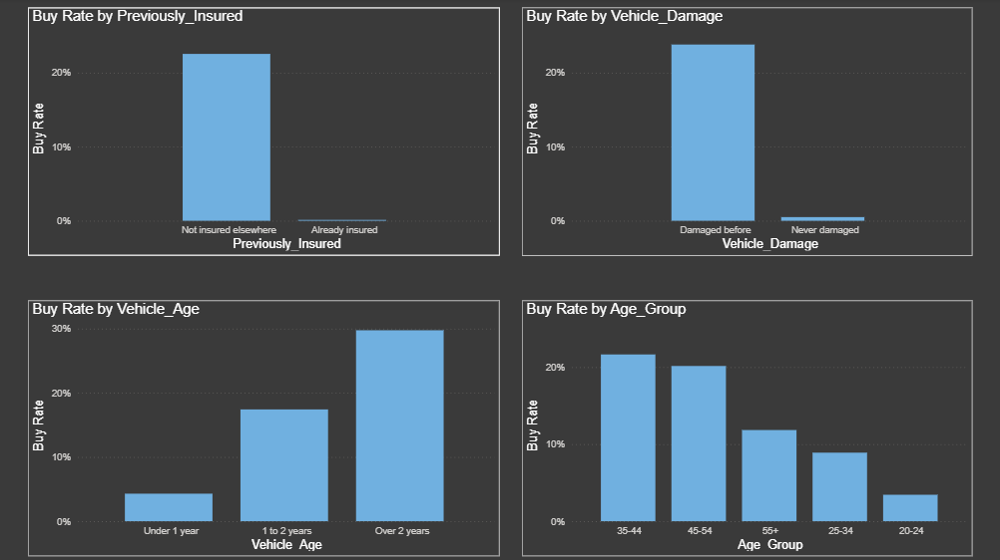
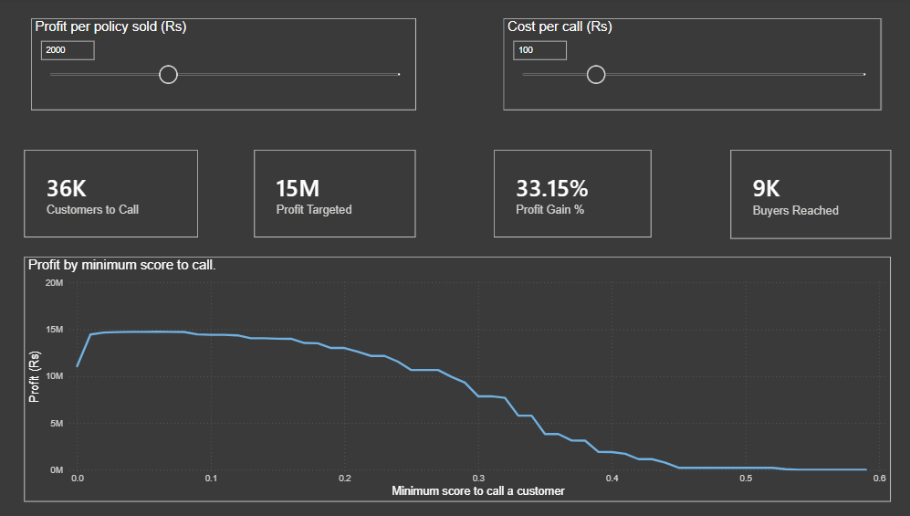
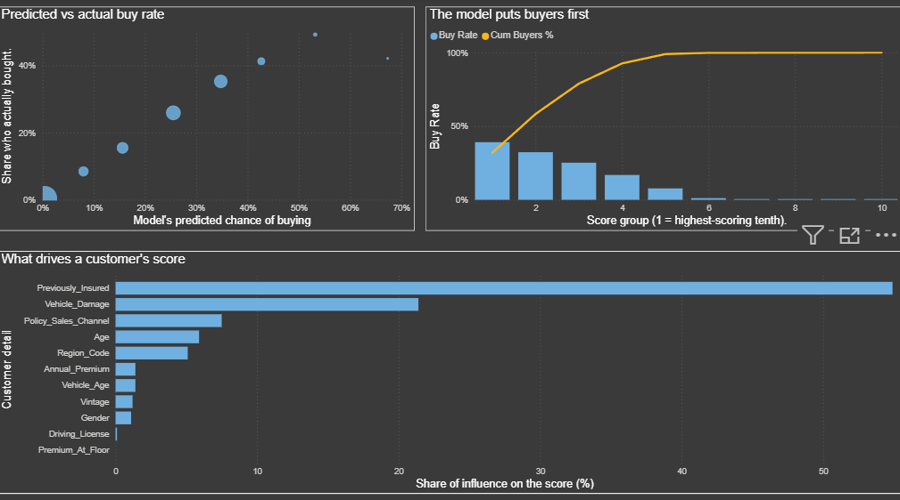
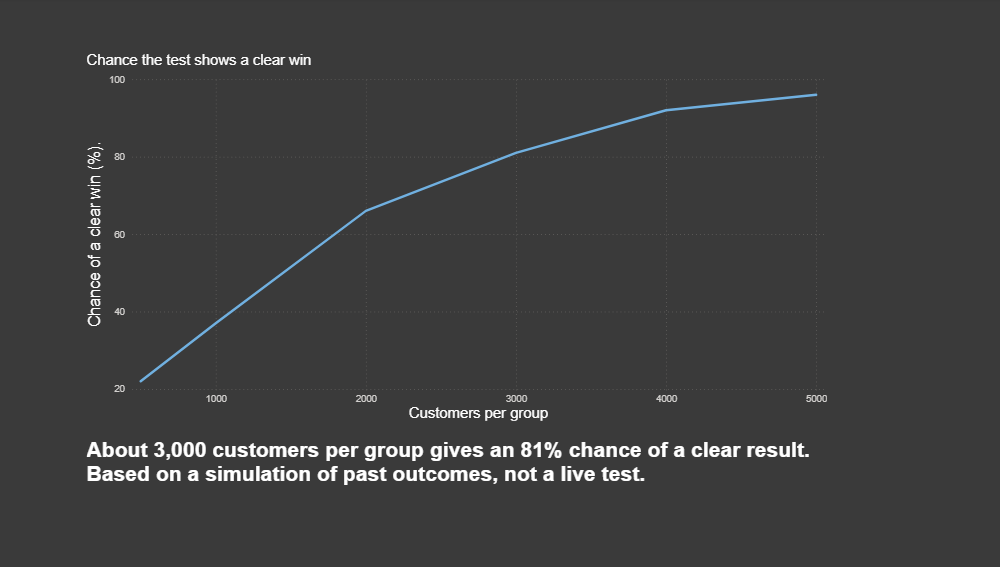

# Insurance-cross-sell-targeting
Insurance cross-sell targeting: Finds which customers are worth a call, so an insurer reaches 98% of buyers with 53% fewer calls and 33% higher campaign profit. LightGBM (ROC-AUC 0.858), calibrated scores, SHAP explanations, A/B test design and a Power BI dashboard.

## The business problem
An insurer wants to sell vehicle insurance to its existing health-insurance customers. Of 381,109 customers, only 12 in 100 said yes. Calling everyone means 88 of every 100 calls are wasted, and every call costs money.

**The question:** which customers are worth calling, and how many should we call before more calls stop paying for themselves?

## What the data shows
- **Customers who already have vehicle insurance elsewhere almost never buy** (0.09%, against 22.55% for those who don't). They are 46% of the customer base.
- **A past vehicle damage claim is the strongest buying signal.** 23.77% of these customers buy, against 0.52% of those with no damage.
- **Older vehicles buy more.** 29% of owners of vehicles over 2 years old buy, against 4% for vehicles under 1 year.
- These two facts (existing cover, past damage) explain about three-quarters of how likely a customer is to buy.

 

## The solution
Every customer gets a score for how likely they are to buy. The scores are checked against what really happened, so a 30% score means about 30 in 100 such customers buy. Customers are then ranked by expected profit: chance of buying x profit per sale - cost of the call. A customer is worth calling only when this is above zero, which at the assumptions below means a score above 5%.

## Results (on 76,222 customers the model had never seen)

| | Call everyone | Call by score |
|---|---|---|
| Calls made | 76,222 | 36,007 |
| Buyers reached | 9,342 | 9,165 (98%) |
| Campaign profit | Rs 1.11 crore | Rs 1.47 crore |

- **53% fewer calls, 98% of buyers still reached, 33% more profit.**
- The model ranks a real buyer above a non-buyer 86% of the time (a coin flip would be 50%).
- The top 30% of customers by score contain 79% of all buyers. The bottom half contains about 1%.

 

## Recommendations
1. **Stop calling customers who already hold vehicle insurance.** It is nearly all wasted spend.
2. **Prioritise customers with a past damage claim and an older vehicle.**
3. **Prove it with a live test before rolling out.** About 3,000 customers per group would give an 81% chance of a clear result.
4. **Replace the assumed profit and call cost with real figures.** The cutoff moves with them: if a call costs Rs 200 and a sale earns Rs 1,000, only 32% of customers are worth calling.

 

## Assumptions and limits
- Profit per sale (Rs 2,000) and cost per call (Rs 100) are assumptions, not facts from the data.
- The live-test result is a simulation based on past outcomes, not a real experiment.
- Age and gender are used only to decide who to call, not what to charge.

## Explore it yourself
`Cross_Sell_Targeting.pbix` is an interactive Power BI dashboard. Move the profit and call-cost sliders to see how the best calling strategy changes. The Python notebook with the full analysis is `cross_sell_targeting.ipynb`.

*Data: Kaggle "Health Insurance Cross Sell Prediction". Built with Python and Power BI.*
